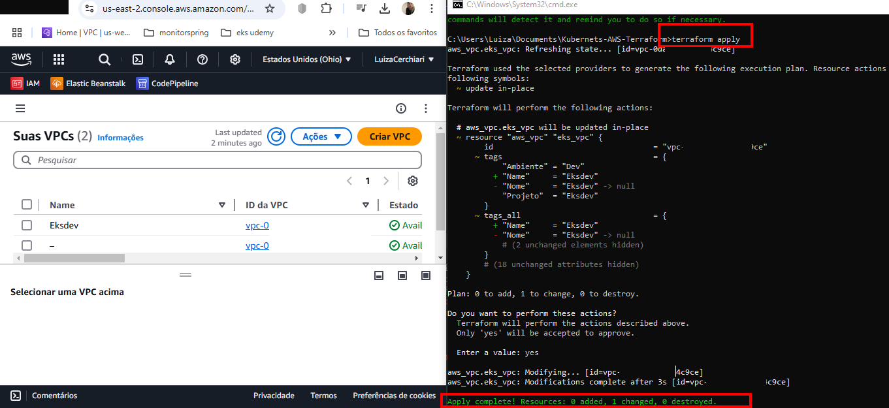
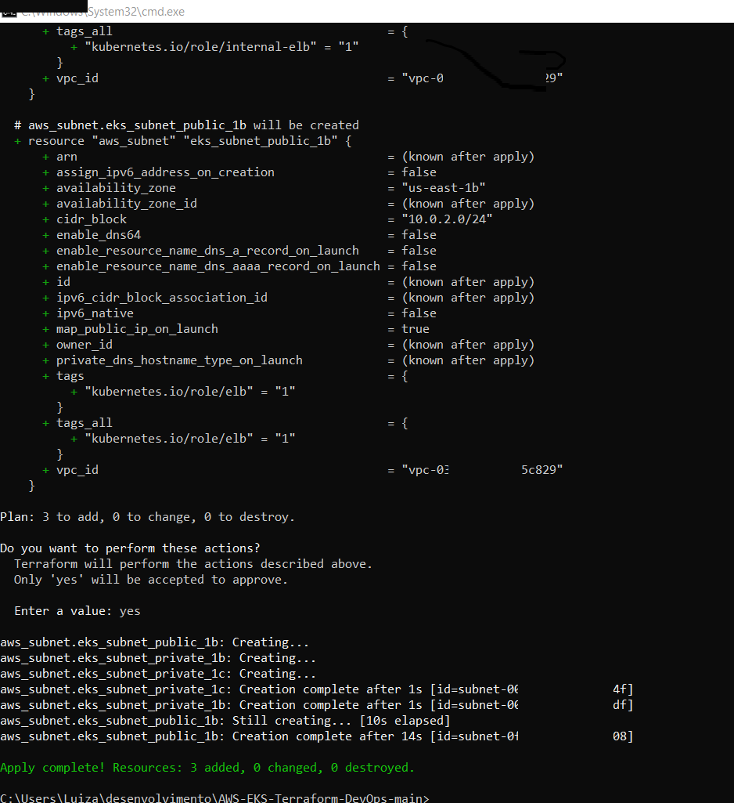

  
# EKS with Terraform

[](https://skillicons.dev)


## 🔗 Links

[](https://br.linkedin.com/in/luiza-andrade-ti/)  [](https://github.com/luizaandradeti/) 

## Source

- https://www.udemy.com/course/terraform-para-aws/

## Requisites

- Account AWS 

## Tech Stack  
**Console AWS:** Create an AWS account 

**CLI access:** Generate CLI access credentials

- AWS CLI https://docs.aws.amazon.com/cli/latest/userguide/getting-started-install.html
- TERRAFORM https://developer.hashicorp.com/terraform/install
- VISUAL STUDIO CODE https://code.visualstudio.com/download
- GITHUB: https://git-scm.com/downloads

## Strategy AWS VPC 

Project made based on AWS documentation:

[EKS userguide docs](https://docs.aws.amazon.com/eks/latest/userguide/network-reqs.html#network-requirements-vpc)

## Requirements

| Nome | Versão |
|------|---------|
| <a name="requirement_aws"></a> [aws](#requirement\_aws) | > 4.40.0 ||
| <a name="requirement_kubernetes"></a> [kubernetes](#requirement\_kubernetes) | > 2.10.0 |


| Location   | AWS Region | IP CIDR       | Address Range               |
|------------|------------|---------------|-----------------------------|
| Ohio       | us-east-2  | 10.0.0.0/16   | 10.0.0.1 - 10.0.255.254    | |

[Ip calculator](https://www.iptp.net/pt_PT/iptp-tools/ip-calculator/)

````
terraform init
terraform plan
terraform apply
````


## Example 
  


## Example 
  

> [!NOTE]
> 
> https://developer.hashicorp.com/terraform
